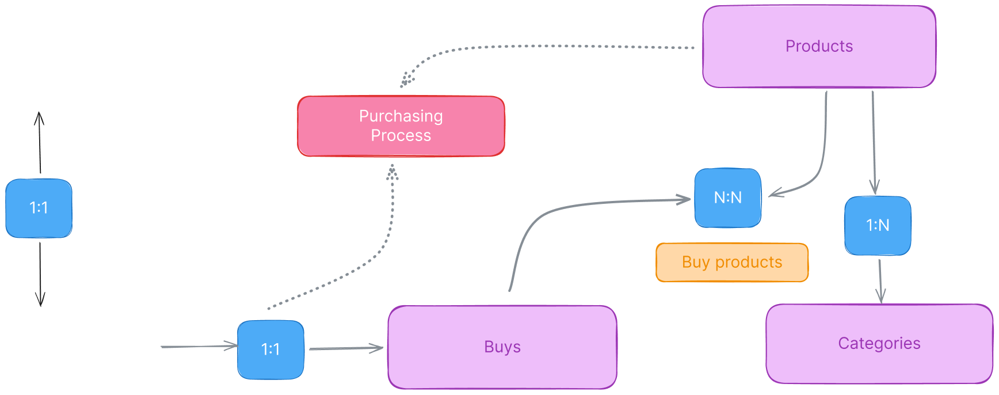

<h1 align="center">
    Storefy-api
</h1>

This project is the backend api for an e-commerce site with nextjs, it's using clean architecture and OOP, with typeorm and class-validator
also it's using typeorm with mysql.

## how it works



## Features

- CRUD users
- user can signup/signin
- CRUD products
- user can sell products
- user can add products to cart
- user can remove product from cart
- user can buy products

## Installation

**Prerequisites:**

- Node.js and npm (or yarn) installed on your system.

1. Clone this repository:

   ```bash
   git clone [invalid URL removed][project-name].git
   ```

2. Navigate to the project directory:

   ```bash
   cd [project-name]
   ```

3. Install dependencies:

   ```bash
   npm install
   # or
   pnpm install
   ```

### Development Setup

1. Start the development server:

   ```bash
   npm dev
   # or
   pnpm dev
   ```

2. (Optional) Run database migrations (if applicable):
   ```bash
   npm run migrate
   # or
   pnpm run migrate
   ```
   This will create database tables based on your TypeORM entities (models).

### Author

[franklin rodriguez](https://github.com/franklinsrr) fullstack developer
